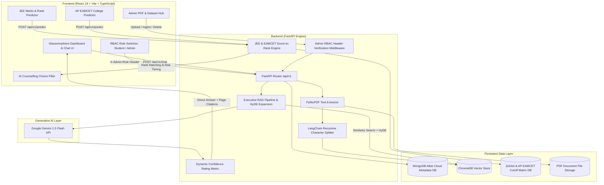

# UniGuide AI & AP EAMCET / AP EAPCET College Predictor Platform

[](LICENSE)
[](https://python.org)
[](https://fastapi.tiangolo.com)
[](https://reactjs.org)
[](https://vitejs.dev)
[](https://www.typescriptlang.org)
[](https://www.trychroma.com)
[](https://www.mongodb.com/cloud/atlas)
[](https://ai.google.dev)
[](https://frontend-peach-nine-9dyn34fhbi.vercel.app)
[](https://rag-document-ihnt.onrender.com)
[](https://collegepipe.in/apeamcet.html)

> **UniGuide AI & AP EAMCET Predictor** is a production-ready, AI-powered college prediction, RAG-driven university assistant, and counselling decision-support platform for **JEE Main / Advanced** and **AP EAMCET / AP EAPCET** aspirants. Powered by Retrieval-Augmented Generation (RAG), ChromaDB vector search, Google Gemini AI, MongoDB Atlas metadata persistence, and a multi-tiered admission probability engine, UniGuide AI transforms complex historical cutoff data into actionable, transparent, and explainable recommendations.

---

## 🌐 Live Application & Deployment Links

| Resource | URL Link | Deployment Status | Description |
| :--- | :--- | :--- | :--- |
| **🐙 GitHub Repository** | [https://github.com/Livesh28/RAG_DOCUMENT](https://github.com/Livesh28/RAG_DOCUMENT) | `Main Branch (Up to date)` | Complete source code, Docker configs, and setup scripts |
| **🚀 Live Application (Vercel)** | [https://frontend-peach-nine-9dyn34fhbi.vercel.app](https://frontend-peach-nine-9dyn34fhbi.vercel.app) | `Active (Production)` | Primary SPA frontend deployed on Vercel Edge Network |
| **🚀 Live Application (Render)** | [https://rag-document-ihnt.onrender.com](https://rag-document-ihnt.onrender.com) | `Active (Production)` | Secondary full-stack deployment on Render |
| **⚙️ Backend API Base** | [https://rag-document-ihnt.onrender.com/api/v1](https://rag-document-ihnt.onrender.com/api/v1) | `Online (REST API)` | FastAPI REST API router endpoint |
| **🎯 Predictor API** | [https://rag-document-ihnt.onrender.com/api/v1/predict](https://rag-document-ihnt.onrender.com/api/v1/predict) | `Interactive` | POST endpoint for score/rank prediction & choice matrix |
| **📖 OpenAPI Swagger Docs** | [https://rag-document-ihnt.onrender.com/docs](https://rag-document-ihnt.onrender.com/docs) | `Live Specs` | Interactive API testing playground and schema viewer |
| **🚀 Live Application (AP EAMCET)** | [https://collegepipe.in/apeamcet.html](https://collegepipe.in/apeamcet.html) | `Active (Production)` | AP EAMCET / AP EAPCET College Predictor Portal |

---

## 🎬 Demo Video

<div align="center">
<iframe src="https://drive.google.com/file/d/1KwtBSWSbu_Wxh8rFHdeJNfqwqW006rmq/preview" width="720" height="420" allow="autoplay; encrypted-media" frameborder="0"></iframe>
</div>

**Watch the full demo on Google Drive:** [View UniGuide AI Demo Video](https://drive.google.com/file/d/1KwtBSWSbu_Wxh8rFHdeJNfqwqW006rmq/view?usp=sharing)

---

## 🎓 AP EAMCET / AP EAPCET College Predictor Specification

### 📌 Overview
The **AP EAMCET College Predictor** subsystem is a modern decision-support tool designed specifically for AP EAMCET / AP EAPCET engineering aspirants. Instead of forcing students to manually search through static PDF cutoff matrices, the system evaluates multi-dimensional student parameters against historical counselling trends.

Inputs analyzed:
- Student Rank
- Reservation Category (`OC`, `OBC-NCL`, `EWS`, `SC`, `ST`, `PwD`)
- Gender (`Gender-Neutral`, `Female-Only`)
- Local Area / Region (`AU`, `SVU`, `OU`, `Non-Local`)
- Preferred Engineering Branches (CSE, AI & ML, AI & DS, IT, ECE, EEE, Mechanical, Civil, Chemical, etc.)
- Preferred Districts / Locations
- Annual Fee Preferences
- College Type Preferences (Government, Private, University, Autonomous)

Colleges and branches are dynamically categorized into 5 probability tiers:
- 🟢 **Safe**: Rank is significantly better than historical closing ranks.
- 🔵 **Likely**: Rank has a strong historical admission probability.
- 🟡 **Moderate**: Rank is close to historical cutoff ranges.
- 🟠 **Reach**: Rank is slightly outside historical ranges but worth targeting.
- 🔴 **Unlikely**: Rank is significantly outside historical cutoff limits.

---

### 🎯 Problem Statement vs. 💡 Our Solution

| Problem Faced by Aspirants | Our Platform Solution |
| :--- | :--- |
| **Overwhelming Cutoff Data**: Thousands of rows across multiple rounds, categories, and colleges. | **Automated Normalization**: Instant filtering and rank comparison across all colleges and branches. |
| **Lack of Personalized Insight**: Generic lists don't answer *"Where can I get admitted?"* | **Personalized Scoring**: Evaluates exact rank, category, gender, and region for tailored predictions. |
| **Complex College Comparison**: Difficulty comparing fees, packages, and accreditations. | **Side-by-Side Comparison**: Interactive matrix comparing fees, NIRF rank, placements, and hostel facilities. |
| **Counselling Preference Confusion**: Inability to strategically order JoSAA / AP EAMCET options. | **AI Choice Generator**: Algorithmic choice ordering tailored to risk tolerance and preference order. |
| **Opaque Cutoff Trends**: Single-year cutoffs miss shift trends over time. | **Multi-Year Trend Analysis**: Displays 3-year cutoff trajectory (e.g., *Becoming more competitive*). |

---

### 🚀 Data & Decision Flow Pipeline

```text
               ┌──────────────────────────────────────────┐
               │              Student Input               │
               │  Rank | Category | Gender | Region | Fee  │
               └────────────────────┬─────────────────────┘
                                    │
                                    ▼
               ┌──────────────────────────────────────────┐
               │            Prediction Engine             │
               │  Historical Cutoff Matrix + Trend Score  │
               └────────────────────┬─────────────────────┘
                                    │
                                    ▼
               ┌──────────────────────────────────────────┐
               │          Tiered Probability Output       │
               │ Safe 🟢 | Likely 🔵 | Moderate 🟡 | Reach  │
               └────────────────────┬─────────────────────┘
                                    │
                                    ▼
               ┌──────────────────────────────────────────┐
               │         Decision Support System          │
               │  Explanations -> Comparisons -> Export   │
               └──────────────────────────────────────────┘
```

---

## 🌟 Key Features & Capabilities

### 🔮 1. Multi-Exam College Prediction (JEE & AP EAMCET)
- **Multi-Mode Rank & Score Inputs**:
  - **JEE Main Subject Marks**: Maths, Physics, Chemistry out of 100 each.
  - **JEE Percentile & AIR**: Direct All India Rank or percentile entry.
  - **JEE Advanced Rank**: Direct IIT eligibility matching.
  - **AP EAMCET / AP EAPCET Rank**: State-level engineering rank matching.
- **NTA & State Normalization Engine**: Calculates estimated percentiles and AIRs based on historical NTA and state distribution curves.

### 📊 2. Tiered Admission Probability Classification
Every prediction result is categorized with clear visual indicators:
- 🟢 **Safe** (Rank <= 70% of historical closing rank)
- 🔵 **Likely** (Rank <= 90% of closing rank)
- 🟡 **Moderate** (Rank <= 105% of closing rank)
- 🟠 **Reach** (Rank <= 125% of closing rank)
- 🔴 **Unlikely** (Rank > 125% of closing rank)

### 🧠 3. Explainable AI Predictions
Instead of returning unexplained labels, the system provides data-backed rationales:
```text
Branch: Computer Science & Engineering
Status: LIKELY 🔵

Your Rank:              12,500
Previous Closing Rank:  15,200
Rank Advantage:          2,700

3-Year Trend:           Moderately Competitive (↑ 4.2%)
Preference Match:       92%
Data Confidence:        High (3+ Years Data Available)

Why this recommendation?
✓ Rank comfortably inside 3-year historical closing range
✓ Branch and district match selected preferences
✓ Annual fee (₹1.2L) is within specified maximum budget (₹1.5L)
```

### 📈 4. Multi-Year Historical Cutoff Trends
Tracks shift trajectories across consecutive counselling cycles:
- **Increasing Competition** (`2023: 18,500` → `2024: 16,200` → `2025: 14,900` — *↑ Becoming harder*)
- **Decreasing Competition** (`2023: 14,500` → `2024: 17,800` → `2025: 20,100` — *↓ Becoming easier*)

### 🏫 5. Comprehensive College Profiles & Comparison
- Profile details include college code, district, affiliation, autonomous status, intake capacity, annual fees, placement packages (average & highest), and hostel availability.
- **Side-by-Side Comparison**: Compare up to 4 colleges simultaneously across cutoffs, fees, placements, and infrastructure.

### ⚡ 6. AI Counselling Preference List Generator (JoSAA & AP EAMCET)
- Automatically generates an optimal option order for counselling rounds combining admission probability, branch priority, and risk distribution (Safety vs. Reach choices).
- **Export Formats**: One-click download as formatted Markdown (`.md`) preference sheets or copy to clipboard.

### 🧠 7. Retrieval-Augmented Generation (RAG) Document Q&A
- **Zero Hallucination Guarantee**: Strict prompt engineering enforces ground-truth extraction from official university document PDFs.
- **Dense Vector Search**: Powered by `BAAI/bge-small-en-v1.5` embeddings and local `ChromaDB` vector store.
- **HyDE Query Expansion**: Uses Hypothetical Document Embeddings (HyDE) for enhanced semantic matching.
- **Page-Level Citations**: Answers include exact PDF filenames and 1-based page numbers.
- **Dynamic Confidence Rating**: Assigns confidence metrics (0.0 to 1.0) and rating tags (`High`, `Medium`, `Low`).

### 🍃 8. MongoDB Atlas & Hybrid Persistence
- **Cloud Metadata Sync**: Persists PDF metadata, upload records, chunk counts, and file stats in MongoDB Atlas.
- **Local Fallback Mode**: Operates using SQLite/hybrid storage if cloud database connectivity is unavailable.

### 🔐 9. Admin Upload Hub & RBAC
- Role-based access control requiring `X-Admin-Role: admin` headers.
- Multi-file PDF drag-and-drop uploading, PyMuPDF text extraction, LangChain recursive text chunking, and ChromaDB vector purging.

---

## 🏗️ System Architecture



---

## 📁 Project Folder Structure

```
rag_documents/
├── backend/
│   ├── app/
│   │   ├── api/
│   │   │   └── v1/
│   │   │       ├── endpoints/
│   │   │       │   ├── chat.py            # RAG Q&A query execution (/chat)
│   │   │       │   ├── documents.py       # MongoDB document list & stats (/documents)
│   │   │       │   ├── ingest.py          # Admin vector embedding ingestion (/ingest)
│   │   │       │   ├── predictor.py       # JEE & AP EAMCET Predictor & Choice Engine (/predict)
│   │   │       │   └── upload.py          # Admin PDF upload & metadata sync (/upload)
│   │   │       └── router.py              # API v1 router definition
│   │   ├── core/                          # Logging, database connection & config
│   │   │   ├── config.py
│   │   │   ├── database.py
│   │   │   └── logging.py
│   │   ├── models/                        # MongoDB & Pydantic data models
│   │   ├── rag/                           # RAG pipeline, HyDE expansion & embeddings
│   │   │   ├── embeddings.py
│   │   │   ├── hyde.py
│   │   │   ├── pipeline.py
│   │   │   └── vector_store.py
│   │   ├── schemas/                       # Pydantic schemas (predictor.py, chat.py)
│   │   └── services/                      # Cutoff database & PDF parsing services
│   ├── chroma_db/                         # Persistent ChromaDB vector index directory
│   ├── uploads/                           # Uploaded PDF document storage
│   ├── main.py                            # FastAPI application entrypoint
│   └── requirements.txt                   # Python backend dependencies
├── frontend/
│   ├── src/
│   │   ├── components/
│   │   │   ├── AIChoiceFillerModal.tsx    # JoSAA / EAMCET Choice Preference Order Modal
│   │   │   ├── HeroSection.tsx            # College Predictor Hero Banner
│   │   │   ├── Navbar.tsx                 # Top navigation header with role switcher
│   │   │   └── Sidebar.tsx                # Navigation sidebar
│   │   ├── pages/
│   │   │   ├── AdminUploadPage.tsx        # Dedicated Admin PDF Upload Hub
│   │   │   ├── Dashboard.tsx              # Student Q&A dashboard
│   │   │   ├── PredictorPage.tsx          # JEE & AP EAMCET College Predictor Tool
│   │   │   └── SettingsPage.tsx           # System architecture & specs page
│   │   ├── services/
│   │   │   └── api.ts                     # Axios REST client & API bindings
│   │   ├── types/                         # TypeScript interfaces & types
│   │   ├── App.tsx                        # Master React application router
│   │   └── main.tsx                       # React DOM entry point
│   ├── vercel.json                        # Vercel SPA build & API proxy configuration
│   ├── vite.config.ts                     # Vite build configuration
│   └── package.json                       # Frontend dependencies & scripts
├── vercel.json                            # Root Vercel routing configuration
├── docker-compose.yml                     # Multi-container orchestrator configuration
├── Dockerfile                             # Production container build file
├── README.md                              # Technical documentation
└── start_production.sh                    # Automated launcher script
```

---

## 🛰️ REST API Specifications

| Method | Endpoint | Access Role | Description |
| :--- | :--- | :--- | :--- |
| `POST` | `/api/v1/predict` | `Student / Admin` | Predicts eligible JEE & AP EAMCET colleges; generates preference lists. |
| `POST` | `/api/v1/chat` | `Student / Admin` | Submits chat question, performs vector similarity search, and returns direct answer with citations. |
| `GET` | `/api/v1/documents` | `Student / Admin` | Returns list of uploaded PDF documents and MongoDB metadata records. |
| `GET` | `/api/v1/documents/stats` | `Student / Admin` | Returns aggregate metrics (total files, ingested vectors, extracted pages). |
| `POST` | `/api/v1/upload` | 🔒 `Admin Only` | Uploads a PDF document and registers metadata in MongoDB Atlas. |
| `POST` | `/api/v1/ingest` | 🔒 `Admin Only` | Extracts text, generates dense vector embeddings, and indexes chunks in ChromaDB. |
| `DELETE` | `/api/v1/documents/{id}` | 🔒 `Admin Only` | Purges PDF file, removes ChromaDB vector embeddings, and deletes MongoDB metadata. |

---

### 📝 Example API Payloads

#### 1. College Predictor (`POST /api/v1/predict`)

**Request Payload:**
```json
{
  "input_mode": "marks",
  "maths_marks": 85.0,
  "physics_marks": 80.0,
  "chemistry_marks": 78.0,
  "category": "OPEN",
  "gender": "Gender-Neutral",
  "home_state": "AU",
  "preferred_branch": "Computer Science",
  "institution_type": "All"
}
```

**Response Payload:**
```json
{
  "total_score": 243.0,
  "maths_score": 85.0,
  "physics_score": 80.0,
  "chemistry_score": 78.0,
  "estimated_percentile": 99.45,
  "estimated_air": 6820,
  "category_rank": 6820,
  "category": "OPEN",
  "gender": "Gender-Neutral",
  "input_mode": "marks",
  "total_matches": 42,
  "high_chance_count": 18,
  "moderate_chance_count": 14,
  "dream_chance_count": 10,
  "predictions": [
    {
      "id": "pred_nit_trichy_cse",
      "institute_name": "National Institute of Technology Tiruchirappalli",
      "short_name": "NIT Trichy",
      "type": "NIT",
      "location": "Tiruchirappalli, Tamil Nadu",
      "state": "Tamil Nadu",
      "branch": "Computer Science and Engineering",
      "category": "OPEN",
      "opening_rank": 1100,
      "closing_rank": 7500,
      "candidate_rank": 6820,
      "chance_level": "High",
      "chance_percentage": 91.2,
      "avg_package_lpa": 27.2,
      "annual_fee_lakhs": 1.78,
      "nirf_rank": 9,
      "recommendation_reason": "Your estimated AIR 6,820 comfortably falls within the historical closing rank of 7,500."
    }
  ],
  "choice_filling_order": [
    {
      "preference_number": 1,
      "institute_name": "National Institute of Technology Tiruchirappalli",
      "branch": "Computer Science and Engineering",
      "type": "NIT",
      "closing_rank": 7500,
      "chance_level": "High",
      "strategy_note": "High-confidence target choice for your rank tier."
    }
  ]
}
```

---

## ⚙️ Environment Variables Configuration (`.env`)

Create a `.env` file inside the `backend/` directory:

```env
# Server Configuration
HOST=0.0.0.0
PORT=8000
ENVIRONMENT=production

# MongoDB Atlas Persistent Database
MONGO_URI=mongodb+srv://<username>:<password>@cluster0.mongodb.net/uniguide_db?retryWrites=true&w=majority
DATABASE_NAME=uniguide_db

# Google Gemini API Key
GEMINI_API_KEY=your_google_gemini_api_key_here

# Vector Store Settings
CHROMA_PERSIST_DIRECTORY=./chroma_db
EMBEDDING_MODEL_NAME=BAAI/bge-small-en-v1.5

# Security
JWT_SECRET=your_super_secret_jwt_key_here
ADMIN_SECRET_KEY=admin
```

For the `frontend/` directory, configure `.env`:

```env
VITE_API_BASE_URL=https://rag-document-ihnt.onrender.com
```

---

## 🚀 Quickstart & Setup Guide

### 📋 Prerequisites
- **Node.js**: `v20.15.0+`
- **Python**: `v3.9+`
- **Docker & Docker Compose**: *(Optional)*

---

### Option A: Automated One-Step Launch (Local Host)

```bash
bash start_production.sh
```

- **Frontend Application**: [http://localhost:3000](http://localhost:3000)
- **FastAPI Backend Server**: [http://localhost:8000](http://localhost:8000)
- **OpenAPI Swagger UI**: [http://localhost:8000/docs](http://localhost:8000/docs)

---

### Option B: Manual Step-by-Step Launch

#### 1. Start FastAPI Backend
```bash
cd backend
python3 -m venv venv
source venv/bin/activate
pip install -r requirements.txt
PYTHONPATH=. python main.py
```

#### 2. Start React Frontend
```bash
cd frontend
npm install
npm run dev -- --port 3000
```

---

### Option C: Unified Docker Container Launch

```bash
docker-compose up -d --build
```

---

## 🛣️ Project Roadmap

- [x] **Phase 1 — Core Architecture**: React + TypeScript frontend, FastAPI backend, ChromaDB vector store.
- [x] **Phase 2 — RAG & Document Q&A**: Zero-hallucination Gemini pipeline with page-level PDF citations.
- [x] **Phase 3 — JEE Marks & Rank Predictor**: Subject score to AIR converter, JoSAA choice preference sheet generator.
- [x] **Phase 4 — AP EAMCET / AP EAPCET Support**: 5-tier probability classification (`Safe`, `Likely`, `Moderate`, `Reach`, `Unlikely`), multi-year trend detection, and explainable recommendations based on [CollegePipe AP EAMCET Specification](https://collegepipe.in/apeamcet.html).
- [ ] **Phase 5 — ML Calibration & AI Assistant**: Natural language counselling assistant and ML-based probability calibration.

---

## ⚠️ Disclaimer

> This platform is designed for educational and counselling decision-support purposes. Predictions are estimates based on historical closing rank data and statistical models. Actual admission results depend on official seat matrices, counselling rounds, reservation rules, and authority decisions. Users should always verify official data with JoSAA, CSAB, and AP EAMCET / AP EAPCET counselling authorities.

---

## 📄 License & Author

- **License**: Released under the [MIT License](LICENSE).
- **Author**: **Livesh L** (Artificial Intelligence & Data Science)
- **References**: [CollegePipe.in AP EAMCET Predictor](https://collegepipe.in/apeamcet.html)

---

<div align="center">
  <b>UniGuide AI & AP EAMCET Predictor</b> — Empowering Indian Higher Education Aspirants with Transparent RAG & Intelligent Rank Matching.
</div>
